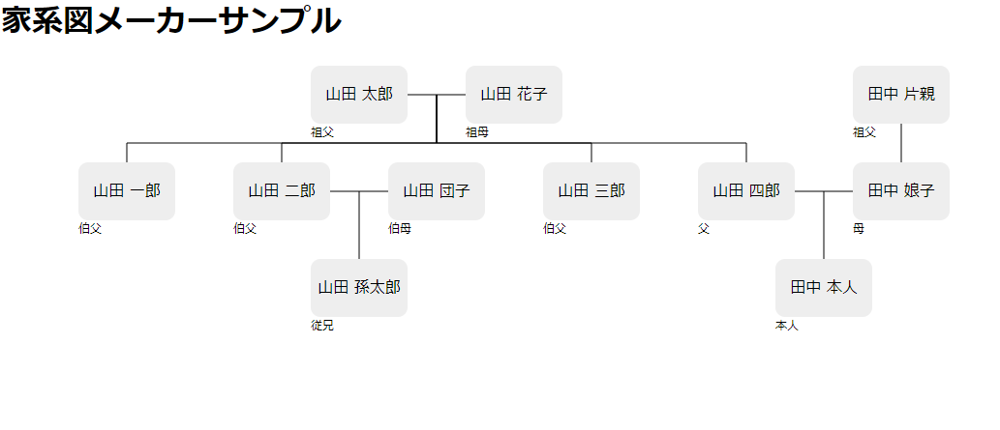

# 家系図つくるやつ

* person: 人物の四角
  * row: 何段目
  * column: 何列目
    - 1段目は0,2,4　2段目は1,3,5と指定すると綺麗に入るようにした。
  * name: 名前
  * message: 関係性などの文字を表示
* marriage: 結婚線、2人のpersonのcolumnを指定する。
* child: 子供線、親の間のcolumn（親が2と4なら3を入れる）と子のcolumnを入れる。
* child_single_person: 片親のみの子供線

